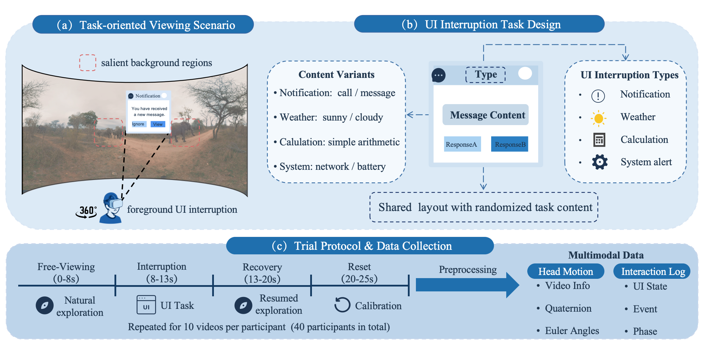

# Interruption360

**Interruption360** is an interruption-aware dataset for **task-oriented 360-degree video viewing**. It is designed to study how **UI-delivered foreground interruptions** reshape immersive viewing behavior in virtual reality.

Unlike conventional 360-degree viewing datasets collected under passive-viewing settings, Interruption360 introduces lightweight **UI interruption tasks** during immersive video watching and records user behavior before, during, and after interruption.

Interruption360 supports research on interruption-aware behavior analysis, task-aware saliency modeling, viewport prediction under UI interruptions, immersive interaction design, and subjective burden analysis in task-oriented XR viewing.

Interruption360 is intended as a controlled **3DoF, head-orientation-based dataset** for lightweight UI-triggered interruptions. It is not intended to be an exhaustive benchmark for all XR interruption layouts, 6DoF navigation, eye-level attention, or device-invariant behavior.

---

## Overview

- **Participants:** 40
- **Videos:** 10 panoramic videos
- **Viewing device:** PICO 4
- **Tracking frequency:** 50 Hz
- **Scenario:** task-oriented 360-degree video viewing with UI interruptions
- **Main data format:** `.csv`

Each participant watched 10 panoramic videos in VR while responding to head-locked UI interruption tasks. Each trial followed a fixed four-phase protocol:

1. **Free-viewing:** 0–8 s
2. **Interruption:** 8–13 s
3. **Recovery:** 13–20 s
4. **Reset:** 20–25 s

The main behavioral analyses use the 0–20 s video-content exposure interval. The 20–25 s reset interval is used to prepare participants for the next trial.

---

## Dataset Overview Figure

The following figure summarizes the Interruption360 data collection pipeline. It illustrates:  
(a) the task-oriented 360-degree viewing scenario with foreground UI interruptions;  
(b) the standardized UI interruption task design with shared layout and randomized content;  
(c) the trial protocol and multimodal data collection process.



**Figure 1. Overview of Interruption360.**  
(a) Task-oriented 360-degree viewing with foreground UI interruptions.  
(b) Standardized UI task design with shared layout and randomized content.  
(c) Trial protocol and multimodal data collection.

---

## Repository Structure

```text
Interruption360/
├── Interruption360/
├── q&v/
├── scripts/
├── figure/
├── LICENSE
├── DATA_LICENSE.md
└── README.md
```

The `Interruption360/` folder contains the released `.csv` files from 40 users.

The `q&v/` folder contains the questionnaire and video-related resources used in the experiment.

The `scripts/` folder contains scripts for loading, preprocessing, analyzing the dataset, and quick-start usage.

The `figure/` folder contains the overview figure used in this README.

---

## Version

Current release: **v1.0.0**

Interruption360 v1.0.0 is the initial public release associated with the ACM MM 2026 Dataset Track submission. It includes de-identified `.csv` data files from 40 users, UI-state annotations, phase labels, and analysis scripts.

Please cite this version when using the dataset.

---

## Dataset Contents

The released `.csv` files contain temporally aligned behavioral and annotation records, including:

- head-motion trajectories
- Euler-angle head orientation
- quaternion head orientation
- video identifiers
- UI display states
- interaction-related annotations
- phase labels

The phase labels include:

- `Free-viewing`
- `Interruption`
- `Recovery`
- `Reset`

The released data are de-identified and do not contain personally identifying information.

---

## UI Interruption Design

The experiment includes four types of UI interruptions:

- **Notification**
- **Weather**
- **Calculation**
- **System alert**

Each interruption appears at the center of the user’s field of view and remains visible for a fixed 5-second window. The UI is head-locked, meaning that it remains at the center of the field of view as the user moves their head.

This design is intentionally controlled. The goal is to ensure reliable foreground task delivery and precise phase alignment across participants and trials, rather than to cover all possible XR notification layouts.

---

## Data Fields

The released `.csv` files contain the following key data fields, consistent with the paper.

| Data Field | Description & Format |
|---|---|
| Timestamp | System clock time in milliseconds (ms). |
| Euler Angles | Raw head orientation (`yaw`, `pitch`, `roll`) in degrees from the HMD. |
| Quaternion | Derived quaternion representation (`x`, `y`, `z`, `w`) used for analysis. |
| Video ID | Integer identifier of the presented 360-degree video. |
| UI Display State | Boolean flag (`True` / `False`) indicating notification. |
| Interruption Event | Boolean flag marking active user responses. |
| Phase Label | Categorical identifier taking one of `{Free-viewing, Interruption, Recovery, Reset}`. |

---

## Scripts

The `scripts/` folder provides the reproduction and analysis code for Interruption360. The code is organized as a Python package and supports the paper-oriented reproduction workflow, including head-motion metric computation, statistical testing, questionnaire analysis, and figure generation.

The main script files are:

| File | Description |
|---|---|
| `__init__.py` | Marks `interruption360_repro` as a Python package and exposes basic shared constants for convenient imports. |
| `__main__.py` | Allows the package to be executed directly with Python and forwards execution to the main reproduction pipeline. |
| `constants.py` | Stores shared constants, including phase names, metric names, Likert mappings, and questionnaire item labels. |
| `figures.py` | Contains plotting functions for paper-facing figures, including phase metric boxplots and the Top-2-box burden chart. |
| `head_motion.py` | Cleans head-motion frame data, computes quaternion-based angular velocity, and aggregates trial-level and subject-level phase metrics. |
| `pipeline.py` | Main orchestration entry point. It runs the paper-limited reproduction workflow, saves tables and figures, and writes the scope report. |
| `questionnaire.py` | Loads the after-test questionnaire, converts Likert responses, extracts participant information, and computes the Top-2-box burden summary. |
| `rating_time.py` | Extracts UI-active intervals from available cleaned frame logs and exports handling-time summary tables as a data check. |
| `statistics.py` | Runs the repeated-measures statistical tests used by the paper-oriented reproduction workflow, including Friedman tests and Holm-corrected Wilcoxon comparisons. |
| `utils.py` | Provides helper functions for natural sorting, user-ID extraction, directory creation, and participant label normalization. |

To run the package-level reproduction pipeline, use:

```bash
python -m interruption360_repro
```

Please adjust the input and output paths in the scripts according to your local repository structure.

---

## Intended Use

Interruption360 can be used for:

- phase-aware viewport behavior analysis
- interruption-aware head-motion modeling
- task-conditioned 360-degree viewing analysis
- task-aware saliency and viewport prediction
- human-centered XR interface research

External saliency models and original video stimuli should be accessed according to their original licenses and terms.

---

## Limitations

Interruption360 is a controlled dataset and has the following limitations:

- it contains 10 panoramic videos
- it was collected on a single PICO 4 headset
- it records 3DoF head orientation rather than 6DoF movement
- it does not include eye-tracking data
- the UI interruptions are centered and head-locked
- the participant group is suitable for a controlled VR user study but does not represent all XR user populations

Therefore, Interruption360 should be used as a controlled baseline for studying phase-aware behavior under lightweight UI interruptions, rather than as a complete benchmark for all XR interruption scenarios.

---

## Privacy and Ethics

The released dataset contains de-identified behavioral records and annotations only. It does not include participant names, contact information, facial images, audio recordings, or other personally identifying information.

All participants provided informed consent before the experiment. Participant identifiers were anonymized before release.

---

## License

This repository uses separate licenses for code and data:

- Code and analysis scripts are released under the MIT License. See `LICENSE`.
- The Interruption360 dataset, including `.csv` behavioral records, UI-state annotations, phase labels, and documentation, is released under the Creative Commons Attribution-NonCommercial 4.0 International License. See `DATA_LICENSE.md`.

The original 360-degree video stimuli are subject to the licenses and terms of their source datasets. Interruption360 does not redistribute or override the licenses of third-party video content.

---

## Citation

If you use this dataset, please cite:

```bibtex
@misc{interruption360_2026,
  title        = {Interruption360: An Interruption-Aware Dataset for Task-Oriented 360-Degree Video Viewing},
  author       = {Anonymous Author(s)},
  year         = {2026},
  version      = {v1.0.0},
  howpublished = {\url{https://github.com/INSLabCN/Interruption360}},
  note         = {Dataset repository}
}
```

After publication, please replace the placeholder citation with the official ACM MM 2026 citation.

---

## Contact

For questions about the dataset, please open an issue in this repository.
